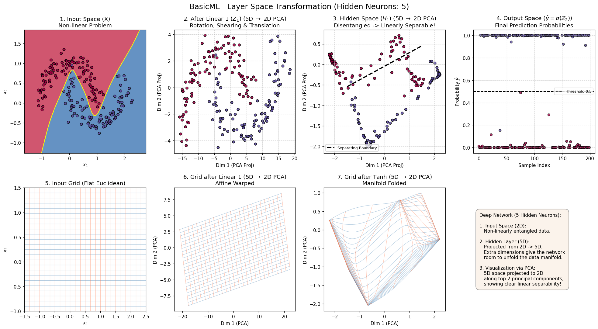
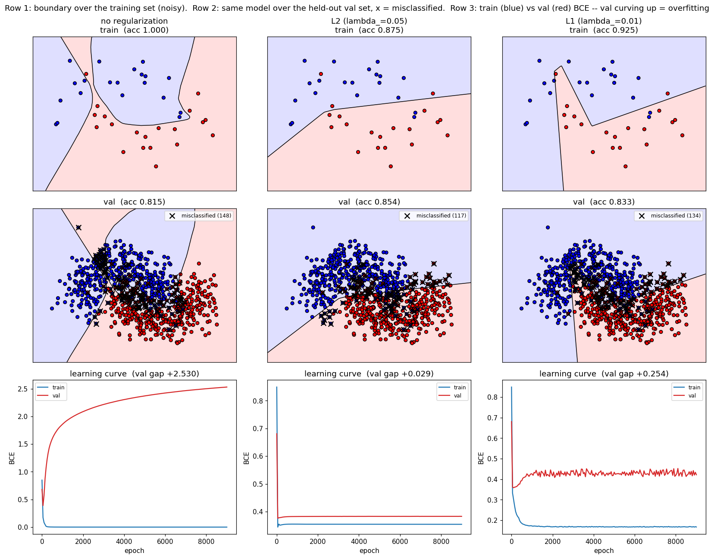
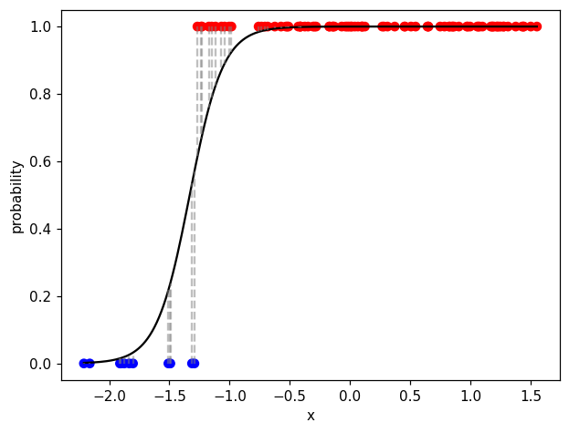

# Deep Learning from Scratch — `BasicML`

[](https://www.python.org/)
[](https://numpy.org/)
[-lightgrey.svg)](#verification--gradient-checking)
[](LICENSE)

> A minimal, **educational** deep learning library built entirely from scratch in
> pure NumPy. There is **no autograd engine** — every forward and backward pass is
> derived and implemented by hand from the underlying matrix calculus.

<p align="center">
  
  <br>
  <em>A hidden layer rotates, shears, and folds the input space until two
  interleaved half-moons become linearly separable — rendered with the library's
  own layers (<code>BasicML/demo/plot_layer_transformations.py</code>).</em>
</p>

---

## Key highlights & philosophy

- **First principles only.** No PyTorch / JAX / TensorFlow. Gradients are computed
  by hand in each module's `backward()` using matrix calculus.
- **Understand the training loop.** The whole flow is explicit and caller-driven:
  `forward → loss → loss.backward() → model.backward(grad) → optimizer.step()`.
- **PyTorch-inspired architecture.** Chosen for its cohesion and loose coupling —
  `Tensor`, `Module`, `Loss`, and `Optimizer` each have one job and depend only on
  small abstract interfaces, so a new layer or optimizer is a new subclass, never
  an edit to existing code.
- **Mathematically verified.** Every layer's hand-derived gradient is checked
  against central finite differences — see [Verification](#verification--gradient-checking)
  (max relative error `< 1e-7`).
- **Clarity over performance.** The code is written to be read and learned from.

---

## Quick start

### 1. Install

```bash
git clone https://github.com/nguyencongminh090/BasicML.git
cd BasicML
pip install numpy pandas matplotlib   # Python >= 3.13
```

### 2. Minimal example — train an MLP

```python
import numpy as np
from basicml.nn.sequential import Sequential
from basicml.nn.linear     import Linear
from basicml.nn.activation  import ReLU
from basicml.nn.loss        import MSELoss
from basicml.optim.sgd      import SGD

# Synthetic data
X = np.random.randn(100, 3)
y = np.random.randn(100, 1)

model     = Sequential(Linear(3, 8), ReLU(), Linear(8, 1))
criterion = MSELoss()
optimizer = SGD(model.parameters(), lr=0.01)

for epoch in range(100):
    y_pred = model(X)                 # forward
    loss   = criterion(y_pred, y)     # loss

    grad = criterion.backward()       # dL/dy_pred
    model.backward(grad)              # manual backprop through every layer

    optimizer.step()                  # parameter update
    optimizer.zero_grad()             # gradients accumulate with +=, so reset

    if epoch % 10 == 0:
        print(f"Epoch {epoch:3d} | Loss: {loss:.4f}")
```

### 3. Run the bundled examples

Each script inserts `BasicML/` onto `sys.path`, so run it directly:

```bash
python BasicML/examples/train_linear.py          # linear regression on data.csv
python BasicML/examples/train_logistic.py        # logistic regression, synthetic 1D data
python BasicML/examples/train_regularization.py  # overfitting vs L1 / L2 on noisy make_moons
```

---

## Verification & gradient checking

Because every `backward()` is written by hand, correctness is proven by comparing
the analytical gradient against a central finite-difference estimate:

```bash
python BasicML/examples/check_gradients.py
```

```
[OK  ] Linear                 max rel err = 9.92e-09
[OK  ] Linear no-bias         max rel err = 8.23e-10
[OK  ] MLP relu/tanh          max rel err = 7.53e-08
[OK  ] MLP sigmoid            max rel err = 8.43e-08
```

Type checking (config in `pyrefly.toml`):

```bash
pyrefly check
```

---

## Project architecture

```
MachineLearning/
└── BasicML/
    ├── basicml/                    # The from-scratch library
    │   ├── tensor.py               # Tensor: thin NumPy wrapper (data, grad, requires_grad)
    │   ├── regularization.py       # Regularizer ABC + L1, L2, ElasticNet
    │   ├── nn/
    │   │   ├── module.py           # Module ABC: forward(), parameters(), train()/eval()
    │   │   ├── linear.py           # Linear layer (Xavier / He init, optional bias)
    │   │   ├── activation.py       # Sigmoid, ReLU, Tanh
    │   │   ├── dropout.py          # Dropout (inverted, train/eval aware)
    │   │   ├── sequential.py       # Sequential: compose layers into a model
    │   │   ├── loss.py             # MSELoss, BinaryCrossEntropy
    │   │   └── init.py             # xavier_normal_, he_normal_, zeros_
    │   ├── optim/
    │   │   ├── optimizer.py        # Optimizer ABC (params, lr, optional regularizer)
    │   │   ├── sgd.py              # Stochastic Gradient Descent
    │   │   └── momentum.py         # SGD with Momentum
    │   ├── datasets/synthetic.py   # make_moons, make_circles
    │   └── visualize/decision_boundary.py  # Plot a 2D decision boundary
    ├── examples/                   # Runnable end-to-end training scripts
    ├── demo/                       # Animated training visualizations
    ├── data.csv                    # Dataset for the linear regression example
    └── logs/                       # Session notes and design write-ups
```

### Components

| Component | Responsibility |
|-----------|----------------|
| **`Tensor`** | Thin wrapper over `numpy.ndarray` carrying `data`, `grad`, `requires_grad`. Arithmetic (`+ - * / @`) composes values but does **not** build a graph. |
| **`nn.Module`** | Abstract base for every layer/model. Provides `__call__`, `parameters()`, and `train()` / `eval()`. Each layer also implements its own `backward()`. |
| **`nn.Linear`** | `X @ w + b` with Xavier or He init and optional bias. `backward` applies the chain rule, accumulates into `w.grad` / `b.grad`, and returns `grad_output @ w.T`. |
| **`nn.activation`** | `Sigmoid`, `ReLU`, `Tanh` — element-wise non-linearities, each a `Module`. |
| **`nn.Dropout`** | Parameter-free layer; inverted dropout during training, no-op under `eval()`. |
| **`nn.Sequential`** | Composes `Module`s: chains `forward` in order, `backward` in reverse, and forwards `parameters()` / `zero_grad()` / `train()`. |
| **`nn.loss`** | `MSELoss`, `BinaryCrossEntropy` (clips predictions to avoid `log(0)`). `__call__` caches the scalar loss; `backward()` returns `dL/dy_pred`. |
| **`regularization`** | `Regularizer` ABC + `L1`, `L2`, `ElasticNet`. An optimizer adds the regularizer's gradient during `step()`. |
| **`optim`** | `SGD` (plain gradient descent) and `Momentum` (accumulated velocity, default `0.9`). Both accept an optional `Regularizer`. |

---

## Interactive demos

Animated visualizations of training dynamics (`python BasicML/demo/<script>.py`):

| Script | What it shows |
|--------|---------------|
| `plot_dynamic_linear.py` | Linear-regression fit, learning curve, and the gradient's path over the cost surface (2D contour + 3D). |
| `plot_dynamic_logistic.py` | The same, for a logistic-regression sigmoid fit on synthetic 1D data. |
| `plot_dynamic_3d_logistic.py` | The BCE cost surface over `(w, b)` and the momentum trajectory across it. |
| `plot_dynamic_decision_boundary.py` | A small MLP's decision region bending epoch by epoch on `make_moons`, next to its learning curve. |
| `plot_dynamic_layer_morphing.py` | Feature space morphing through each layer of a deep MLP — points and a coordinate grid deforming until the classes separate. |
| `plot_dynamic_mlp_graph.py` | A deep MLP as a live neuron/weight graph — per-layer weight & gradient heatmaps, gradient-flow and ReLU activation panels, plain vs Dropout+L2 side by side. |
| `plot_dynamic_vanishing_gradient.py` | Sigmoid+Xavier vs ReLU+He deep MLP: the per-layer gradient RMS staircase and mean `f'(z)` product make the vanishing gradient visible. |
| `plot_layer_transformations.py` | Static multi-panel version of the layer-morphing demo (the banner image). |

<p align="center">
  
  <br>
  <em><code>train_regularization.py</code>: an over-capacity MLP memorizes the noisy
  training set (left) while the held-out validation loss climbs; L2 / L1 shrink the
  train/val gap.</em>
</p>

<p align="center">
  
  <br>
  <em><code>train_logistic.py</code>: the learned sigmoid and per-point residuals.</em>
</p>

---

## Roadmap

| Area | Item | Status |
|------|------|--------|
| Machine Learning | Linear regression, gradient descent | ✅ Done |
| Machine Learning | Logistic regression, binary classification | ✅ Done |
| Deep Learning | MLP via `Sequential`, manual backpropagation | ✅ Done |
| Deep Learning | Weight init (Xavier / He), numerical gradient checking | ✅ Done |
| Deep Learning | Regularization (L1 / L2 / ElasticNet), Dropout | ✅ Done |
| Deep Learning | CNN, RNN, Attention | ⏳ Planned |
| Deep Learning | Transformer from scratch | ⏳ Planned |
| Infrastructure | Reverse-mode autograd on `Tensor` | ⏳ Planned |

---

## Design notes

Longer write-ups on the architecture decisions and the math behind each module
live in [`BasicML/logs/`](BasicML/logs/):

- [2026-07-27](BasicML/logs/2026-07-27_1724.md) — decoupling layers / activations / losses; the PyTorch-style `Module` design.
- [2026-08-10](BasicML/logs/2026-08-10_2037.md) — what MLPs are for, and how they differ conceptually from linear / logistic regression.
- [2026-08-10](BasicML/logs/2026-08-10_2015.md) — project tooling: `CLAUDE.md`, the `.claude/` skill setup, and the `ai-audit/` workspace.

---

## License

[MIT](LICENSE) © 2026 nguyenminh
